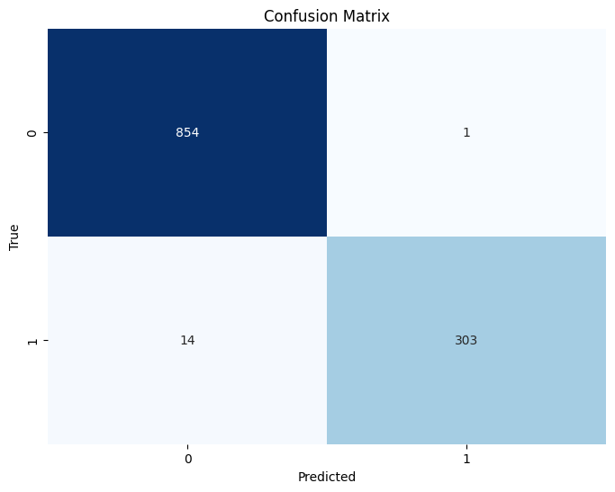

# Spam Filter with Naive Bayes and TF-IDF

This project demonstrates the implementation of a spam filter using Natural Language Processing (NLP) techniques and a Naive Bayes classifier. The steps include preprocessing email data, feature extraction with TF-IDF, training a Multinomial Naive Bayes model, evaluating its performance, and providing predictions.

## Project Overview

### Key Features
1. **Email Cleaning:** Preprocess email text by removing HTML tags, punctuation, and stopwords, followed by stemming.
2. **Feature Extraction:** Use TF-IDF to convert cleaned text into numerical features for machine learning.
3. **Model Training:** Train a Multinomial Naive Bayes model for spam classification.
4. **Evaluation Metrics:** Measure model performance using accuracy, precision, recall, F1-score, and confusion matrix.
5. **Deployment Options:** Provide a command-line interface for email classification.

### Prerequisites
- Python 3.7+
- Required libraries: `os`, `re`, `BeautifulSoup`, `nltk`, `pandas`, `sklearn`, `matplotlib`, `seaborn`

### Setup Instructions
1. Clone the repository or download the script.
2. Install the required libraries:
   ```bash
   pip install nltk beautifulsoup4 pandas scikit-learn matplotlib seaborn
   ```
3. Download NLTK resources:
   ```python
   import nltk
   nltk.download('stopwords')
   nltk.download('punkt')
   ```
4. Place spam and ham emails in `data/spam` and `data/ham` directories, respectively.

## Usage

### Data Loading
Email data is loaded from the `spam` and `ham` directories. Each email is labeled as `1` for spam and `0` for ham.

```python
spam_directory = "data/spam"  
ham_directory = "data/ham"   
df = load_data(spam_directory, ham_directory)
```

### Feature Extraction
Use TF-IDF to convert email text into numerical features:
```python
X_train, X_test, y_train, y_test = train_test_split(
    df["text"], df["label"], test_size=0.2, random_state=42
)

# Create TF-IDF vectorizer
tfidf_vectorizer = TfidfVectorizer(max_features=5000)
X_train_tfidf = tfidf_vectorizer.fit_transform(X_train)
X_test_tfidf = tfidf_vectorizer.transform(X_test)
```

### Model Training
Train a Multinomial Naive Bayes model:
```python
from sklearn.naive_bayes import MultinomialNB

nb_classifier = MultinomialNB()
nb_classifier.fit(X_train_tfidf, y_train)
```

### Evaluation
Evaluate the trained model using various metrics:
```python
from sklearn.metrics import accuracy_score, precision_score, recall_score, f1_score, confusion_matrix
import seaborn as sns
import matplotlib.pyplot as plt

# Predictions
y_pred = nb_classifier.predict(X_test_tfidf)

# Metrics
accuracy = accuracy_score(y_test, y_pred)
precision = precision_score(y_test, y_pred)
recall = recall_score(y_test, y_pred)
f1 = f1_score(y_test, y_pred)

print(f"Accuracy: {accuracy:.4f}")
print(f"Precision: {precision:.4f}")
print(f"Recall: {recall:.4f}")
print(f"F1-score: {f1:.4f}")

# Confusion Matrix
cm = confusion_matrix(y_test, y_pred)
plt.figure(figsize=(8, 6))
sns.heatmap(cm, annot=True, fmt="d", cmap="Blues", cbar=False)
plt.xlabel("Predicted")
plt.ylabel("True")
plt.title("Confusion Matrix")
plt.show()
```

### Command-line Email Classification
Classify a new email as spam or ham:
```python
def classify_email(email_text, vectorizer, classifier):
    cleaned_text = clean_email(email_text)
    tfidf_vector = vectorizer.transform([cleaned_text])
    prediction = classifier.predict(tfidf_vector)[0]
    return "Spam" if prediction == 1 else "Ham"

new_email = """
Subject: You've won a free iPhone!

Congratulations! You've been selected to win a brand new iPhone 14 Pro Max. 
Click here to claim your prize now: [malicious link]
"""

prediction = classify_email(new_email, tfidf_vectorizer, nb_classifier)
print(f"The email is classified as: {prediction}")
```

### Output Example
```plaintext
Accuracy: 0.9872
Precision: 0.9967
Recall: 0.9558
F1-score: 0.9758

The email is classified as: Spam
```

### Optional Deployment
Consider deploying the model using a web framework like Flask or Streamlit for ease of use.

## Visualization


## Acknowledgments
- **NLTK** for text preprocessing.
- **scikit-learn** for feature extraction and model training.
- **BeautifulSoup** for HTML cleaning.
